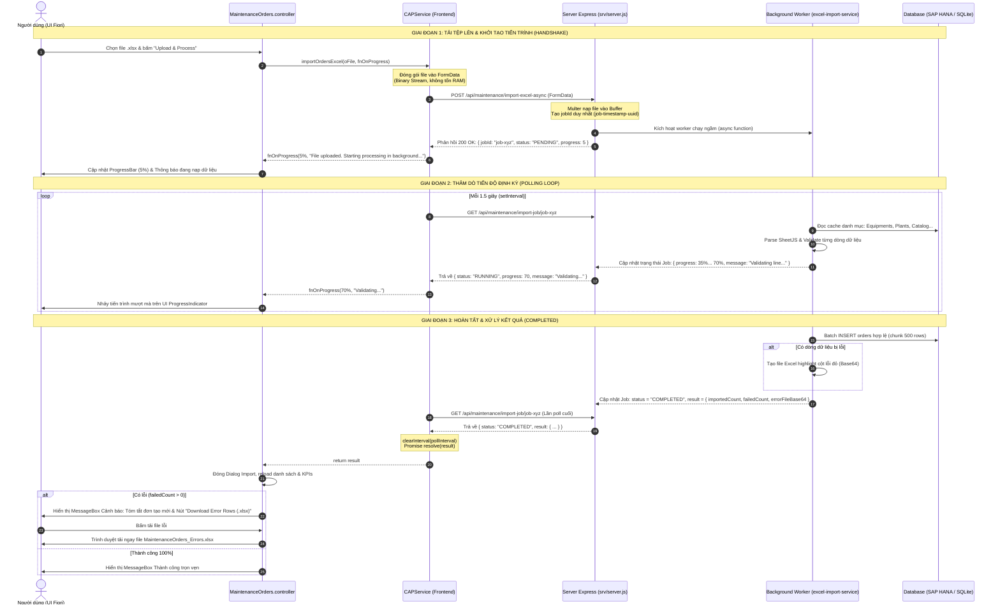
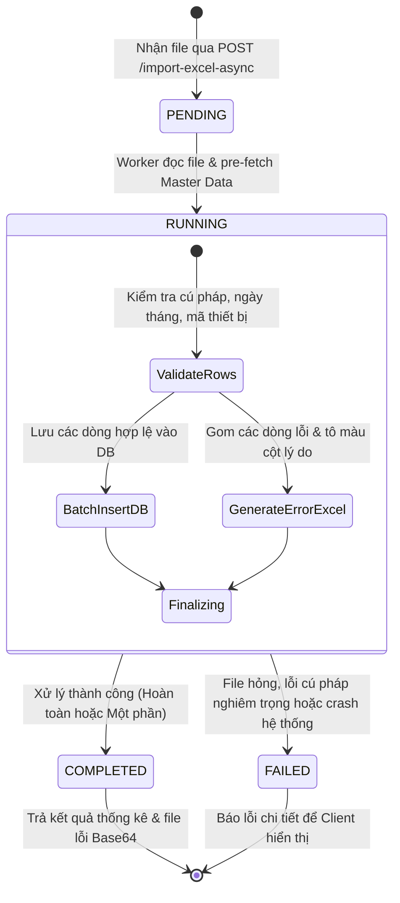

# Kiến Trúc & Lưu Đồ Tuần Tự: Import Excel Bất Đồng Bộ (Async Import & Polling)

Tài liệu này mô tả chi tiết quy trình xử lý upload file Excel dung lượng lớn (hàng chục nghìn dòng) bằng kỹ thuật **Asynchronous Background Processing kết hợp Client Polling** nhằm ngăn chặn triệt để lỗi **HTTP 504 Gateway Timeout** trên môi trường SAP BTP / Cloud Foundry.

---

## 1. Biểu Đồ Tuần Tự (Sequence Diagram)

---

## 2. Lưu Đồ Trạng Thái Tiến Trình Nền (Job State Machine)

---

## 3. Bảng Chi Tiết Các Bước Giao Tiếp API

| Bước | Giao Thức & Endpoint | Payload Gửi Đi | Dữ Liệu Trả Về | Ý Nghĩa Kỹ Thuật |
|:---|:---|:---|:---|:---|
| **1** | `POST /api/maintenance/import-excel-async` | `multipart/form-data` chứa file binary | `{ "jobId": "job-172589...", "status": "PENDING", "progress": 5 }` | Gửi file nhanh chóng. Server trả về Job ID ngay lập tức (**< 2s**) để tránh HTTP 504 Gateway Timeout. |
| **2** | `GET /api/maintenance/import-job/:jobId` *(Định kỳ 1.5s)* | *None* | `{ "jobId": "...", "status": "RUNNING", "progress": 45, "message": "Validating row 2250/5000..." }` | Polling thăm dò tiến độ. Tải dữ liệu rất nhẹ (< 200 bytes), truyền tiến trình liên tục lên UI. |
| **3** | `GET /api/maintenance/import-job/:jobId` *(Lần cuối)* | *None* | `{ "status": "COMPLETED", "result": { "importedCount": 4980, "failedCount": 20, "errorFileBase64": "..." } }` | Worker xử lý xong. Dừng chu kỳ poll (`clearInterval`), bóc tách dữ liệu để hiển thị kết quả. |
| **4 (Dự phòng)** | `GET /api/maintenance/download-errors/:jobId` | *None* | File binary `.xlsx` | Endpoint tải trực tiếp file dòng lỗi từ Server trong trường hợp không giải mã được Base64 trên Client. |

---

## 4. Các File Mã Nguồn Tham Chiếu
- **UI Controller**: [MaintenanceOrders.controller.js](file:///d:/%C4%90%E1%BB%92%20%C3%81N%20%C4%90I%20L%C3%80M/FPT/maintenance-cockpit2/app/webapp/controller/MaintenanceOrders.controller.js#L1091-L1226)
- **Frontend Service Layer**: [CAPService.js](file:///d:/%C4%90%E1%BB%92%20%C3%81N%20%C4%90I%20L%C3%80M/FPT/maintenance-cockpit2/app/webapp/model/CAPService.js#L391-L470)
- **Backend Server Router**: [srv/server.js](file:///d:/%C4%90%E1%BB%92%20%C3%81N%20%C4%90I%20L%C3%80M/FPT/maintenance-cockpit2/srv/server.js#L350-L450)
- **Import Engine & Validation**: [srv/excel-import-service.js](file:///d:/%C4%90%E1%BB%92%20%C3%81N%20%C4%90I%20L%C3%80M/FPT/maintenance-cockpit2/srv/excel-import-service.js#L345-L950)
