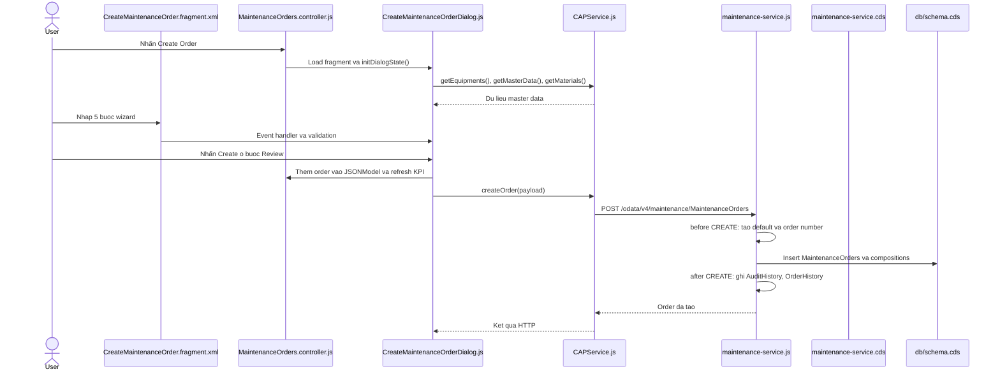

# Create Maintenance Order Flow

Tài liệu này mô tả luồng khi người dùng tạo một Maintenance Order từ giao diện SAPUI5 đến CAP backend và database.

## Tổng Quan



## Các Bước UI5

1. Người dùng vào route `RouteMaintenanceOrders` được khai báo trong [app/webapp/manifest.json](app/webapp/manifest.json).
2. Người dùng nhấn Create Order. Method `onCreateOrderPress()` trong [app/webapp/controller/MaintenanceOrders.controller.js](app/webapp/controller/MaintenanceOrders.controller.js) gọi private method `_openCreateOrderDialog()`.
3. `_openCreateOrderDialog()` dùng `sap/ui/core/Fragment` lazy-load [app/webapp/view/fragment/CreateMaintenanceOrder.fragment.xml](app/webapp/view/fragment/CreateMaintenanceOrder.fragment.xml) và gắn `CreateMaintenanceOrderDialog` làm controller cho fragment.
4. `initDialogState()` trong [app/webapp/controller/CreateMaintenanceOrderDialog.js](app/webapp/controller/CreateMaintenanceOrderDialog.js) tạo JSON model tên `createOrder`, đặt các giá trị mặc định và gọi tải master data.
5. Wizard gồm năm bước: Equipment/Plant, Basic Information, Operations, Materials và Review. Các event `change`, `liveChange` và `press` trong fragment gọi các method `onCreateOrder...`, `onAddOperation`, `onAddMaterial` của dialog controller.
6. Mỗi bước được kiểm tra qua `_validateCreateOrderStep1()`, `onCreateOrderStep2Change()` và `_isCreateOrderStepValid()`. Chỉ khi hợp lệ nút Next/Create mới cho phép thao tác.
7. Ở bước Review, `onCreateOrderNext()` gọi `_createMaintenanceOrder()`.

## Payload Tạo Order

`_createMaintenanceOrder()` tạo object OData rồi gọi:

```javascript
CAPService.createOrder({
  order_no: "MO-...",
  equipment_no: "EQ-...",
  description: "...",
  plant: "1000",
  maintenance_type: "PREVENTIVE",
  priority: "LOW",
  priority_state: "Information",
  status: "OPEN",
  status_state: "Success",
  planner: "JOHN",
  scheduled_from: "YYYY-MM-DD",
  scheduled_to: "YYYY-MM-DD",
  operation_count: 1,
  planned_hours: 2,
  operations: [
    /* MaintenanceOperations */
  ],
});
```

Trước khi request hoàn tất, code hiện tại thêm order mới vào model `orders`, `OrderRepository`, Audit History và KPI. Đây là optimistic update: giao diện phản hồi ngay. Nếu request thất bại, lỗi chỉ được ghi ra browser console; order local hiện chưa được rollback tự động.

## Luồng HTTP Và Backend

`createOrder()` trong [app/webapp/model/CAPService.js](app/webapp/model/CAPService.js) gửi request sau:

```http
POST /odata/v4/maintenance/MaintenanceOrders
Content-Type: application/json
```

Service contract trong [srv/maintenance-service.cds](srv/maintenance-service.cds) expose entity `MaintenanceOrders` từ database schema. Rule `restrict` cho phép `Admin` và `any` thực hiện `CREATE`.

CAP handler trong [srv/maintenance-service.js](srv/maintenance-service.js) thực hiện:

1. `before('CREATE', 'MaintenanceOrders')`: tạo `order_no` nếu client không gửi, đặt `status = OPEN`, `status_state = Success` và `etag` mặc định.
2. CAP ghi entity `MaintenanceOrders` và mảng `operations` composition xuống database.
3. `after('CREATE', 'MaintenanceOrders')`: ghi một record vào `AuditHistory` và một record vào `OrderHistory` với user hiện tại.

Schema trong [db/schema.cds](db/schema.cds) định nghĩa:

- `MaintenanceOrders`: bản ghi order chính.
- `MaintenanceOperations`: composition của order; khóa gồm `order_no` và `no`.
- `OrderMaterials`: composition vật tư của order.
- `OrderHistory`: lịch sử nghiệp vụ của order.
- `AuditHistory`: nhật ký audit toàn hệ thống.

## Vai Trò Từng File

| File                                                                                                                         | Công dụng trong tính năng tạo order                                                                |
| ---------------------------------------------------------------------------------------------------------------------------- | -------------------------------------------------------------------------------------------------- |
| [app/webapp/view/MaintenanceOrders.view.xml](app/webapp/view/MaintenanceOrders.view.xml)                                     | Chứa nút Create Order và gắn event `onCreateOrderPress`.                                           |
| [app/webapp/controller/MaintenanceOrders.controller.js](app/webapp/controller/MaintenanceOrders.controller.js)               | Controller trang danh sách: lazy-load fragment, giữ instance dialog và refresh KPI sau khi tạo.    |
| [app/webapp/view/fragment/CreateMaintenanceOrder.fragment.xml](app/webapp/view/fragment/CreateMaintenanceOrder.fragment.xml) | Giao diện Dialog/Wizard, data binding với model `createOrder` và khai báo event handler.           |
| [app/webapp/controller/CreateMaintenanceOrderDialog.js](app/webapp/controller/CreateMaintenanceOrderDialog.js)               | Điều phối wizard: load master data, validate input, tạo payload, optimistic update và gọi backend. |
| [app/webapp/model/CAPService.js](app/webapp/model/CAPService.js)                                                             | HTTP client dùng `fetch`; `createOrder(payload)` gửi OData POST đến CAP service.                   |
| [app/webapp/model/OrderRepository.js](app/webapp/model/OrderRepository.js)                                                   | Store in-memory để thêm order mới ngay trên client.                                                |
| [app/webapp/model/AuditHistoryService.js](app/webapp/model/AuditHistoryService.js)                                           | Thêm audit record lên UI ngay và POST record vào OData `AuditHistory`.                             |
| [srv/maintenance-service.cds](srv/maintenance-service.cds)                                                                   | Khai báo OData endpoint, entity projection và quyền `CREATE`.                                      |
| [srv/maintenance-service.js](srv/maintenance-service.js)                                                                     | CAP lifecycle handler: default data trước khi tạo, audit/history sau khi tạo.                      |
| [db/schema.cds](db/schema.cds)                                                                                               | Mô hình dữ liệu CAP và quan hệ composition giữa order, operations, materials, history.             |
| [db/data/sap.cap.maintenance-MaintenanceOrders.csv](db/data/sap.cap.maintenance-MaintenanceOrders.csv)                       | Dữ liệu seed chỉ dùng để khởi tạo môi trường development, không xử lý request runtime.             |

## Dữ Liệu Master Được Dùng Khi Tạo

Dialog controller gọi `CAPService.getEquipments()`, `getMasterData()` và `getMaterials()` để điền dropdown. Những API này lấy các entity `Equipments`, `Plants`, `MaintenanceTypes`, `Priorities`, `Planners` và `Materials` từ cùng OData service.

## Lưu Ý Quan Trọng

[app/webapp/model/CAPService.js](app/webapp/model/CAPService.js) hiện có Git merge conflict marker (`<<<<<<<`, `=======`, `>>>>>>>`). JavaScript file này phải được resolve trước khi app có thể load `CAPService` và gọi `createOrder()` ổn định.

Ngoài ra, frontend đang tự sinh `order_no` để hiển thị ngay, trong khi backend cũng có khả năng sinh `order_no` khi payload không truyền giá trị. Nên để backend là nguồn xác thực cuối cùng và đồng bộ lại danh sách order sau khi POST thành công nếu cần bảo đảm dữ liệu UI khớp database.
