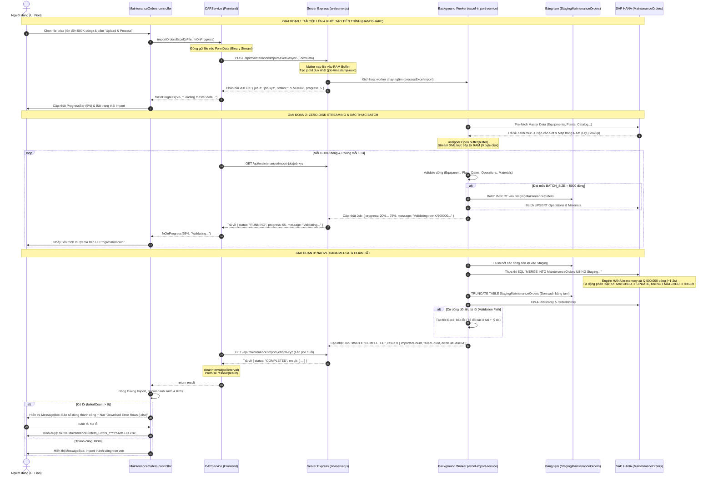
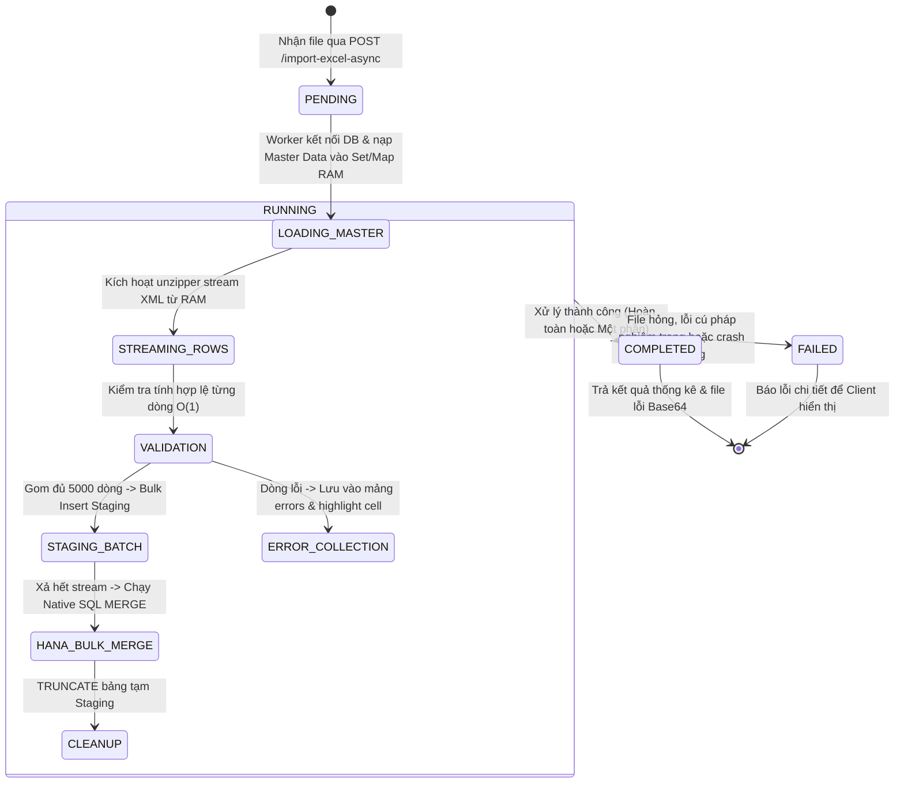

# Kiến Trúc & Lưu Đồ Tuần Tự: Import Excel Quy Mô Lớn (Zero-Disk Streaming & Async HANA Bulk Merge)

Tài liệu này mô tả chi tiết kiến trúc và quy trình xử lý upload file Excel/CSV quy mô lớn (**lên đến 500.000+ dòng**) bằng kỹ thuật **Zero-Disk In-Memory Streaming**, **Xử lý Bất đồng bộ (Async Background Polling)** và **SAP HANA Native Bulk Merge**. Kiến trúc này giải quyết triệt để các vấn đề:
1. **HTTP 504 Gateway Timeout** trên SAP BTP / Cloud Foundry Router.
2. **Lỗi `ENOSPC` (hết dung lượng ổ cứng `/tmp`)** khi giải nén file Excel dung lượng lớn.
3. **Lỗi `Out Of Memory` (OOM)** trên container Node.js bằng cách giới hạn mức chiếm dụng RAM < 50MB.
4. **Tối ưu tốc độ DB** với cơ chế hai giai đoạn: Bảng tạm Staging $\rightarrow$ In-Memory `MERGE INTO` của SAP HANA.

---

## 1. Biểu Đồ Tuần Tự (Sequence Diagram)

---

## 2. Lưu Đồ Trạng Thái Tiến Trình Nền (Job State Machine)

---

## 3. Tại Sao Phải Dùng Bảng Tạm (Staging Table) & HANA Bulk Merge?

| Vấn Đề | Nếu Chèn Trực Tiếp Vào Bảng Chính | Kiến Trúc Dùng Bảng Tạm + HANA MERGE |
|:---|:---|:---|
| **Hiệu năng xử lý 500.000 dòng** | Mất **15 – 30 phút**, dễ bị Router Gateway Timeout (504). | **Chỉ mất ~ 2 – 3 phút** nhờ cơ chế Bulk Insert thô vào bảng tạm và Native In-Memory Merge. |
| **Xử lý Thêm mới vs Cập nhật (Upsert)** | Node.js phải `SELECT` từng dòng để kiểm tra trước $\rightarrow$ nghẽn I/O. | Câu lệnh `MERGE INTO` trên SAP HANA tự động so khớp khóa và phân nhánh `UPDATE` / `INSERT` song song ở mức phần cứng. |
| **An toàn giao dịch (Atomic)** | Nếu rớt mạng ở dòng 200.000, dữ liệu rác dở dang bị kẹt lại bảng chính. | Bảng chính chỉ nhận dữ liệu khi toàn bộ file đã được kiểm tra hợp lệ 100%. |
| **Tránh khoá bảng (Locking)** | Khóa bảng `MaintenanceOrders` liên tục trong nhiều phút $\rightarrow$ làm đơ/treo ứng dụng Fiori của các kỹ sư khác. | Thao tác import diễn ra trên bảng tạm riêng biệt; thao tác trên bảng chính chỉ diễn ra trong **1-2 giây**. |

---

## 4. Bảng Chi Tiết Các Bước Giao Tiếp API

| Bước | Giao Thức & Endpoint | Payload Gửi Đi | Dữ Liệu Trả Về | Ý Nghĩa Kỹ Thuật |
|:---|:---|:---|:---|:---|
| **1** | `POST /api/maintenance/import-excel-async` | `multipart/form-data` chứa file binary | `{ "jobId": "job-172589...", "status": "PENDING", "progress": 5 }` | Gửi file nhanh chóng. Server trả về Job ID ngay lập tức (**< 2s**) để tránh HTTP 504 Gateway Timeout. |
| **2** | `GET /api/maintenance/import-job/:jobId` *(Định kỳ 1.5s)* | *None* | `{ "jobId": "...", "status": "RUNNING", "progress": 45, "message": "Validating row 225000/500000..." }` | Polling thăm dò tiến độ. Tải dữ liệu rất nhẹ (< 200 bytes), cập nhật Progress Bar liên tục. |
| **3** | `GET /api/maintenance/import-job/:jobId` *(Lần cuối)* | *None* | `{ "status": "COMPLETED", "result": { "importedCount": 499950, "failedCount": 50, "errorFileBase64": "..." } }` | Worker xử lý xong. Dừng chu kỳ poll (`clearInterval`), hiển thị tóm tắt và kích hoạt tải file lỗi nếu có. |
| **4 (Dự phòng)** | `GET /api/maintenance/download-errors/:jobId` | *None* | File binary `.xlsx` | Endpoint tải trực tiếp file dòng lỗi từ Server trong trường hợp không giải mã được Base64 trên Client. |

---

## 5. Các File Mã Nguồn Tham Chiếu
- **UI Controller**: [MaintenanceOrders.controller.js](file:///d:/ĐỒ%20ÁN%20ĐI%20LÀM/FPT/maintenance-cockpit2/app/webapp/controller/MaintenanceOrders.controller.js)
- **Frontend Service Layer**: [CAPService.js](file:///d:/ĐỒ%20ÁN%20ĐI%20LÀM/FPT/maintenance-cockpit2/app/webapp/model/CAPService.js)
- **Backend Server Router**: [srv/server.js](file:///d:/ĐỒ%20ÁN%20ĐI%20LÀM/FPT/maintenance-cockpit2/srv/server.js)
- **Import Engine & Zero-Disk Streaming**: [srv/excel-import-service.js](file:///d:/ĐỒ%20ÁN%20ĐI%20LÀM/FPT/maintenance-cockpit2/srv/excel-import-service.js)
- **Database Schema & Staging Table**: [db/schema.cds](file:///d:/ĐỒ%20ÁN%20ĐI%20LÀM/FPT/maintenance-cockpit2/db/schema.cds)
