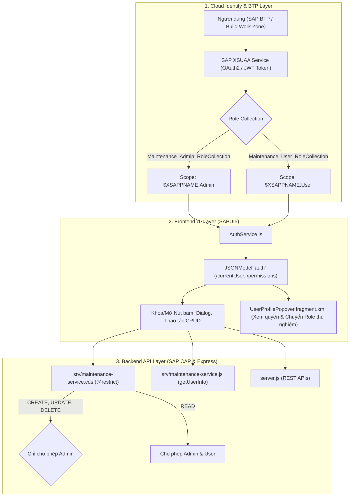

# 🛡️ TÀI LIỆU CHI TIẾT VỀ CƠ CHẾ PHÂN QUYỀN (AUTHORIZATION & RBAC)
> **Dự án**: SAP CAP Maintenance Management Cockpit  
> **Kiến trúc**: Role-Based Access Control (RBAC) 3 tầng: SAP BTP XSUAA $\rightarrow$ SAP CAP Service $\rightarrow$ SAPUI5 / Fiori UI Enforce.

---

## 📑 MỤC LỤC
1. [Tổng quan Kiến trúc Phân quyền (Security Architecture)](#1-tổng-quan-kiến-trúc-phân-quyền-security-architecture)
2. [Các Vai trò & Ma trận Quyền hạn (Roles & Permission Matrix)](#2-các-vai-trò--ma-trận-quyền-hạn-roles--permission-matrix)
3. [Cấu hình Bảo mật SAP BTP XSUAA (`xs-security.json`)](#3-cấu-hình-bảo-mật-sap-btp-xsuaa-xs-securityjson)
4. [Bảo vệ Dữ liệu Tầng Backend (CAP CDS Annotations & Handlers)](#4-bảo-vệ-dữ-liệu-tầng-backend-cap-cds-annotations--handlers)
5. [Kiểm soát Giao diện Tầng Frontend (SAPUI5 `AuthService`)](#5-kiểm-soát-giao-diện-tầng-frontend-sapui5-authservice)
6. [Bảng Tra Cứu Hàm Kiểm Tra Quyền trong Mã Nguồn (Code Mapping)](#6-bảng-tra-cứu-hàm-kiểm-tra-quyền-trong-mã-nguồn-code-mapping)
7. [Hướng dẫn Kiểm thử Phân quyền (Testing & Role Simulation)](#7-hướng-dẫn-kiểm-thử-phân-quyền-testing--role-simulation)

---

## 1. Tổng quan Kiến trúc Phân quyền (Security Architecture)

Hệ thống bảo vệ dữ liệu và chức năng theo nguyên lý **Phòng thủ đa tầng (Defense in Depth)** gồm 3 lớp độc lập:



1. **Lớp 1 (SAP BTP Cloud Foundry & XSUAA)**: Xác thực danh tính người dùng thông qua Single Sign-On (SSO), cấp phát JWT Token chứa các Scopes (`Admin` hoặc `User`).
2. **Lớp 2 (SAPUI5 Frontend Controller & View)**: Mô hình [`AuthService.js`](file:///d:/%C4%90%E1%BB%92%20%C3%81N%20%C4%90I%20L%C3%80M/FPT/maintenance-cockpit2/app/webapp/model/AuthService.js) nạp hồ sơ người dùng, tự động cấp các cờ boolean (`createOrder`, `editOrder`, `deleteOrder`...) để chặn người dùng trái phép ngay tại giao diện.
3. **Lớp 3 (SAP CAP Backend Engine)**: Rào chắn cuối cùng với annotations `@(restrict: [...])` trên [`srv/maintenance-service.cds`](file:///d:/%C4%90%E1%BB%92%20%C3%81N%20%C4%90I%20L%C3%80M/FPT/maintenance-cockpit2/srv/maintenance-service.cds), đảm bảo kể cả khi có người dùng gọi API trực tiếp thì hệ thống vẫn chặn quyền ghi (Write Operations).

---

## 2. Các Vai trò & Ma trận Quyền hạn (Roles & Permission Matrix)

Hệ thống phân định rõ rệt thành **2 nhóm vai trò**:

| Đặc điểm | Quản trị viên (Administrator / `admin`) | Người dùng thường (Standard User / `user`) |
|---|---|---|
| **Mô tả** | Người phụ trách điều phối, lập lịch và quản lý bảo trì toàn quyền. | Kỹ sư vận hành, giám sát viên hoặc người chỉ có nhu cầu tra cứu. |
| **Quyền truy cập** | **Toàn quyền (Full CRUD)**: Tạo, Sửa, Xóa, Hủy, Đóng đơn, Import/Export. | **Chỉ đọc (Read-Only Viewer)**: Tra cứu danh sách, xem chi tiết, xem biểu đồ KPI, Export báo cáo. |
| **Tài khoản mặc định (Local)** | `admin` (mật khẩu: `123`) | `user` (mật khẩu: `123`) |
| **Tài khoản BTP Cloud** | `yuhuyle3@gmail.com` (hoặc email có chứa `admin`) | `lehoangngocthoi01@gmail.com` và các người dùng thông thường |

### Ma trận 12 Cờ Quyền hạn (`permissions` Object)

Mỗi tài khoản khi đăng nhập sẽ sở hữu một đối tượng `permissions` trong mô hình `auth`:

```json
{
  "createOrder": true,
  "massChange": true,
  "editOrder": true,
  "deleteOrder": true,
  "cancelOrder": true,
  "completeOrder": true,
  "addOperation": true,
  "deleteOperation": true,
  "batchEditOperations": true,
  "addMaterial": true,
  "assignTechnician": true,
  "export": true
}
```

| Cờ Quyền (`permissions.<key>`) | Administrator | Standard User | Ý nghĩa & Vị trí áp dụng trong ứng dụng |
|---|:---:|:---:|---|
| `createOrder` | ✅ **Cho phép** | ❌ **Bị chặn** | Nhấn nút **Create Order** hoặc nút **Import Orders (Excel)** trên trang danh sách. |
| `massChange` | ✅ **Cho phép** | ❌ **Bị chặn** | Nhấn nút **Mass Change** để sửa hàng loạt đơn hàng đã chọn. |
| `editOrder` | ✅ **Cho phép** | ❌ **Bị chặn** | Nhấn nút **Edit** hoặc **Submit** trên trang chi tiết đơn hàng ([MaintenanceOrderDetail](file:///d:/%C4%90%E1%BB%92%20%C3%81N%20%C4%90I%20L%C3%80M/FPT/maintenance-cockpit2/app/webapp/controller/MaintenanceOrderDetail.controller.js)). |
| `deleteOrder` | ✅ **Cho phép** | ❌ **Bị chặn** | Xóa đơn hàng khỏi hệ thống cơ sở dữ liệu. |
| `cancelOrder` | ✅ **Cho phép** | ❌ **Bị chặn** | Mở hộp thoại hủy đơn hàng và ghi nhận lý do hủy (**Cancel Order Dialog**). |
| `completeOrder` | ✅ **Cho phép** | ❌ **Bị chặn** | Đóng đơn hàng khi các bước công việc đã hoàn thành (**Complete Order**). |
| `addOperation` | ✅ **Cho phép** | ❌ **Bị chặn** | Thêm bước công việc bảo trì mới vào đơn (**Add Operation**). |
| `deleteOperation` | ✅ **Cho phép** | ❌ **Bị chặn** | Xóa một bước công việc khỏi đơn hàng. |
| `batchEditOperations` | ✅ **Cho phép** | ❌ **Bị chặn** | Chỉnh sửa trạng thái hoặc kỹ thuật viên cho nhiều bước công việc cùng lúc. |
| `addMaterial` | ✅ **Cho phép** | ❌ **Bị chặn** | Thêm phụ tùng/vật tư thay thế vào đơn hàng (**Add Material**). |
| `assignTechnician` | ✅ **Cho phép** | ❌ **Bị chặn** | Phân công kỹ thuật viên phụ trách bước công việc (**Assign Technician**). |
| `export` | ✅ **Cho phép** | ✅ **Cho phép** | Xuất dữ liệu đơn hàng ra file Excel / CSV hoặc in ấn báo cáo. |

---

## 3. Cấu hình Bảo mật SAP BTP XSUAA (`xs-security.json`)

Tệp cấu hình bảo mật chuẩn SAP BTP nằm tại [`xs-security.json`](file:///d:/%C4%90%E1%BB%92%20%C3%81N%20%C4%90I%20L%C3%80M/FPT/maintenance-cockpit2/xs-security.json):

```json
{
  "xsappname": "zpm-maintenance-cockpit",
  "tenant-mode": "dedicated",
  "description": "Security profile of Maintenance Management Cockpit",
  "scopes": [
    {
      "name": "$XSAPPNAME.Admin",
      "description": "Administrator with full maintenance order and master data write permissions"
    },
    {
      "name": "$XSAPPNAME.User",
      "description": "Standard user with read-only access to maintenance orders and dashboards"
    }
  ],
  "role-templates": [
    {
      "name": "AdminRoleTemplate",
      "description": "Administrator Role Template for Maintenance Management Cockpit",
      "scope-references": ["$XSAPPNAME.Admin"]
    },
    {
      "name": "UserRoleTemplate",
      "description": "Standard User Role Template for Maintenance Management Cockpit",
      "scope-references": ["$XSAPPNAME.User"]
    }
  ],
  "role-collections": [
    {
      "name": "Maintenance_Admin_RoleCollection",
      "description": "Full access to Maintenance Management Cockpit (Create, Edit, Cancel, Operations, Technicians)",
      "role-template-references": ["$XSAPPNAME.AdminRoleTemplate"]
    },
    {
      "name": "Maintenance_User_RoleCollection",
      "description": "Standard read and viewer access to Maintenance Management Cockpit",
      "role-template-references": ["$XSAPPNAME.UserRoleTemplate"]
    }
  ]
}
```

### Cách gán quyền trên SAP BTP Cockpit:
1. Đăng nhập vào **SAP BTP Cockpit** $\rightarrow$ Chọn **Subaccount** $\rightarrow$ **Security** $\rightarrow$ **Users**.
2. Chọn tài khoản người dùng cần phân quyền:
   - Nếu muốn cấp quyền Quản trị viên: Gán Role Collection `Maintenance_Admin_RoleCollection`.
   - Nếu muốn cấp quyền Xem chỉ đọc: Gán Role Collection `Maintenance_User_RoleCollection`.

---

## 4. Bảo vệ Dữ liệu Tầng Backend (CAP CDS Annotations & Handlers)

### 4.1. Khai báo Annotations `@(restrict: [...])`
Tại tệp [`srv/maintenance-service.cds`](file:///d:/%C4%90%E1%BB%92%20%C3%81N%20%C4%90I%20L%C3%80M/FPT/maintenance-cockpit2/srv/maintenance-service.cds), mọi thực thể (Entities) đều được bảo vệ chặt chẽ bằng OData Annotations:

```cds
// 1. Thực thể Đơn hàng chính: Mọi người đều được đọc, chỉ Admin được ghi/sửa/xóa
entity MaintenanceOrders @(
  restrict: [
    { grant: 'READ', to: ['User', 'Admin', 'any'] },
    { grant: ['CREATE', 'UPDATE', 'DELETE'], to: ['Admin', 'any'] }
  ]
) as projection on my.MaintenanceOrders;

// 2. Các thực thể liên quan: Operations, Materials, Technicians
entity MaintenanceOperations @(
  restrict: [
    { grant: 'READ', to: ['User', 'Admin', 'any'] },
    { grant: ['CREATE', 'UPDATE', 'DELETE'], to: ['Admin', 'any'] }
  ]
) as projection on my.MaintenanceOperations;

// 3. Danh mục tham chiếu Master Data: Chỉ cấp quyền ĐỌC (Read-Only)
entity MaterialCatalog @(
  restrict: [
    { grant: 'READ', to: ['User', 'Admin', 'any'] }
  ]
) as projection on my.MaterialCatalog;
```

### 4.2. API Lấy Danh tính Người dùng Hiện tại (`getUserInfo`)
Tại tệp [`srv/maintenance-service.js`](file:///d:/%C4%90%E1%BB%92%20%C3%81N%20%C4%90I%20L%C3%80M/FPT/maintenance-cockpit2/srv/maintenance-service.js), backend cung cấp function OData `getUserInfo` trích xuất thông tin người dùng từ Security Context:

```javascript
this.on("getUserInfo", async (req) => {
  const user = req.user;
  const userId = user && user.id ? user.id : "admin";
  const isAdmin = user && typeof user.is === "function"
    ? user.is("Admin")
    : userId.toLowerCase().includes("admin");
  const isUser = user && typeof user.is === "function" ? user.is("User") : true;

  return {
    id: userId,
    name: displayName,
    email: email,
    roles: isAdmin ? ["Admin"] : ["User"],
    isAdmin: isAdmin,
    isUser: isUser,
  };
});
```

---

## 5. Kiểm soát Giao diện Tầng Frontend (SAPUI5 `AuthService`)

Frontend sử dụng dịch vụ trung tâm [`AuthService.js`](file:///d:/%C4%90%E1%BB%92%20%C3%81N%20%C4%90I%20L%C3%80M/FPT/maintenance-cockpit2/app/webapp/model/AuthService.js) để cung cấp trạng thái đăng nhập cho toàn bộ ứng dụng thông qua mô hình dữ liệu `auth`.

### 5.1. Cơ chế Tự động Nhận diện Danh tính (Single Sign-On Detection)
Khi ứng dụng chạy trong môi trường **SAP Build Work Zone** hoặc **Fiori Launchpad**, hàm `fetchSapUser()` tự động lấy danh tính từ container:

```javascript
// Trích xuất thông tin người dùng từ Shell Container
const lpUser = (function () {
  if (window.sap && sap.ushell && sap.ushell.Container) {
    const u = sap.ushell.Container.getUser();
    if (u && (u.getId() || u.getEmail())) {
      return { id: u.getId(), email: u.getEmail(), name: u.getFullName() };
    }
  }
  return null;
})();
```

Hàm `_applyLaunchpadUser(lpUser)` xác định vai trò:
* Nếu email là `yuhuyle3@gmail.com` hoặc username có chứa chữ `admin` $\rightarrow$ Nhận vai trò **Administrator** (`isAdmin: true`, mở 100% quyền).
* Các tài khoản khác (ví dụ `lehoangngocthoi01@gmail.com`) $\rightarrow$ Nhận vai trò **Standard User** (`isAdmin: false`, chế độ Chỉ Đọc).

### 5.2. Popover Hồ sơ & Chế độ Giả lập Vai trò (Admin Simulation Switcher)
Tại góc trên thanh Header, người dùng có thể nhấn vào Avatar để mở [`UserProfilePopover.fragment.xml`](file:///d:/%C4%90%E1%BB%92%20%C3%81N%20%C4%90I%20L%C3%80M/FPT/maintenance-cockpit2/app/webapp/view/fragment/UserProfilePopover.fragment.xml):
* **Hiển thị Avatar & Huy hiệu Vai trò**: `Admin` (Màu xanh lá - Success) hoặc `User` (Màu xanh dương - Information).
* **Danh sách Trạng thái Quyền**: Danh sách trực quan hiển thị biểu tượng tick xanh (`sap-icon://accept`) cho quyền được phép và dấu chéo đỏ (`sap-icon://decline`) cho quyền bị hạn chế.
* **Công tắc Chuyển đổi Tài khoản (`SegmentedButton`)**:
  * Nếu người dùng gốc là **Administrator**, hệ thống hiển thị thanh chuyển đổi để Admin có thể tạm thời đóng vai **Standard User** nhằm kiểm thử giao diện phía người dùng thường mà không cần đăng xuất.
  * Nếu người dùng gốc là **Standard User**, phần chuyển đổi sẽ bị ẩn hoàn toàn để đảm bảo tính nghiêm ngặt.

---

## 6. Bảng Tra Cứu Hàm Kiểm Tra Quyền trong Mã Nguồn (Code Mapping)

Dưới đây là danh mục chi tiết các hàm trong controller trực tiếp thực hiện kiểm tra quyền trước khi xử lý:

| Tệp Controller | Tên Hàm | Cờ Quyền Kiểm Tra | Hành Vi Khi Bị Chặn (Không Có Quyền) |
|---|---|---|---|
| [`MaintenanceOrders.controller.js`](file:///d:/%C4%90%E1%BB%92%20%C3%81N%20%C4%90I%20L%C3%80M/FPT/maintenance-cockpit2/app/webapp/controller/MaintenanceOrders.controller.js) | `onCreateOrderPress()` | `permissions.createOrder` | Hiển thị cảnh báo `MessageBox.warning("Action requires Administrator privileges.")` và không mở dialog tạo đơn. |
| [`MaintenanceOrders.controller.js`](file:///d:/%C4%90%E1%BB%92%20%C3%81N%20%C4%90I%20L%C3%80M/FPT/maintenance-cockpit2/app/webapp/controller/MaintenanceOrders.controller.js) | `onMassChangePress()` | `permissions.massChange` | Hiển thị cảnh báo `MessageBox.warning` và chặn mở hộp thoại thay đổi hàng loạt. |
| [`MaintenanceOrders.controller.js`](file:///d:/%C4%90%E1%BB%92%20%C3%81N%20%C4%90I%20L%C3%80M/FPT/maintenance-cockpit2/app/webapp/controller/MaintenanceOrders.controller.js) | `onImportOrdersPress()` | `permissions.createOrder` | Chặn người dùng thường mở hộp thoại import Excel. |
| [`MaintenanceOrderDetail.controller.js`](file:///d:/%C4%90%E1%BB%92%20%C3%81N%20%C4%90I%20L%C3%80M/FPT/maintenance-cockpit2/app/webapp/controller/MaintenanceOrderDetail.controller.js) | `onEdit()` | `permissions.editOrder` | Hiển thị thông báo `MessageToast.show` yêu cầu quyền Admin, không cho phép mở form chỉnh sửa đơn. |
| [`MaintenanceOrderDetail.controller.js`](file:///d:/%C4%90%E1%BB%92%20%C3%81N%20%C4%90I%20L%C3%80M/FPT/maintenance-cockpit2/app/webapp/controller/MaintenanceOrderDetail.controller.js) | `onSubmit()` | `permissions.editOrder` | Chặn gửi đơn hàng từ trạng thái `OPEN` sang `IN_PROCESS`. |
| [`MaintenanceOrderDetail.controller.js`](file:///d:/%C4%90%E1%BB%92%20%C3%81N%20%C4%90I%20L%C3%80M/FPT/maintenance-cockpit2/app/webapp/controller/MaintenanceOrderDetail.controller.js) | `onComplete()` | `permissions.completeOrder` | Chặn người dùng thường hoàn tất và đóng đơn hàng. |
| [`MaintenanceOrderDetail.controller.js`](file:///d:/%C4%90%E1%BB%92%20%C3%81N%20%C4%90I%20L%C3%80M/FPT/maintenance-cockpit2/app/webapp/controller/MaintenanceOrderDetail.controller.js) | `onCancel()` | `permissions.cancelOrder` | Chặn mở hộp thoại hủy đơn hàng. |
| [`MaintenanceOrderDetail.controller.js`](file:///d:/%C4%90%E1%BB%92%20%C3%81N%20%C4%90I%20L%C3%80M/FPT/maintenance-cockpit2/app/webapp/controller/MaintenanceOrderDetail.controller.js) | `onAddOperation()` | `permissions.addOperation` | Chặn mở form thêm bước công việc bảo trì mới. |
| [`MaintenanceOrderDetail.controller.js`](file:///d:/%C4%90%E1%BB%92%20%C3%81N%20%C4%90I%20L%C3%80M/FPT/maintenance-cockpit2/app/webapp/controller/MaintenanceOrderDetail.controller.js) | `onDeleteOperation(e)` | `permissions.deleteOperation` | Không xóa dòng công việc và hiện cảnh báo từ chối truy cập. |
| [`MaintenanceOrderDetail.controller.js`](file:///d:/%C4%90%E1%BB%92%20%C3%81N%20%C4%90I%20L%C3%80M/FPT/maintenance-cockpit2/app/webapp/controller/MaintenanceOrderDetail.controller.js) | `onEditOperation(e)` | `permissions.editOrder` | Chặn chỉnh sửa thông tin bước công việc. |
| [`MaintenanceOrderDetail.controller.js`](file:///d:/%C4%90%E1%BB%92%20%C3%81N%20%C4%90I%20L%C3%80M/FPT/maintenance-cockpit2/app/webapp/controller/MaintenanceOrderDetail.controller.js) | `onBatchEditOperations()` | `permissions.batchEditOperations` | Chặn tính năng cập nhật trạng thái/kỹ thuật viên hàng loạt trong bảng Operations. |
| [`MaintenanceOrderDetail.controller.js`](file:///d:/%C4%90%E1%BB%92%20%C3%81N%20%C4%90I%20L%C3%80M/FPT/maintenance-cockpit2/app/webapp/controller/MaintenanceOrderDetail.controller.js) | `onAddMaterial()` | `permissions.addMaterial` | Chặn mở hộp thoại cấp phát vật tư/phụ tùng thay thế. |
| [`MaintenanceOrderDetail.controller.js`](file:///d:/%C4%90%E1%BB%92%20%C3%81N%20%C4%90I%20L%C3%80M/FPT/maintenance-cockpit2/app/webapp/controller/MaintenanceOrderDetail.controller.js) | `onAssignTechnician()` | `permissions.assignTechnician` | Chặn mở danh sách phân công nhân sự bảo trì. |
| [`MainLayout.controller.js`](file:///d:/%C4%90%E1%BB%92%20%C3%81N%20%C4%90I%20L%C3%80M/FPT/maintenance-cockpit2/app/webapp/controller/MainLayout.controller.js) | `onSwitchAccount(oEvent)` | `canSwitchRole` | Gọi `AuthService.switchAccount(sKey)` để chuyển đổi trạng thái phiên làm việc tức thì. |

---

## 7. Hướng dẫn Kiểm thử Phân quyền (Testing & Role Simulation)

### Kịch bản 1: Đăng nhập với quyền Quản trị viên (Admin)
1. Mở ứng dụng, nhấn vào Avatar góc phải trên màn hình.
2. Kiểm tra thông tin hiển thị:
   - Tên: **Administrator**
   - Vai trò: **Admin** (Huy hiệu màu xanh lá cây)
   - Tất cả 5 mục quyền hạn đều hiển thị biểu tượng tick xanh `Allowed`.
3. Kiểm tra các chức năng:
   - Nút **Create Order** $\rightarrow$ Bấm mở được hộp thoại tạo đơn bình thường.
   - Nút **Import Orders** $\rightarrow$ Bấm mở được hộp thoại upload Excel.
   - Vào chi tiết một đơn hàng $\rightarrow$ Các nút **Edit**, **Submit**, **Cancel Order**, **Add Operation**, **Add Material** đều hoạt động trơn tru.

### Kịch bản 2: Giả lập chuyển sang quyền Người dùng thường (Standard User)
1. Nhấn vào Avatar góc phải trên màn hình để mở **User Profile Popover**.
2. Tại mục **Switch Account**, nhấn chọn tab **Standard User (Read-Only)**.
3. Thông báo xuất hiện: `"Switched to Standard User (User)"`.
4. Kiểm tra các chức năng:
   - Nhấn **Create Order** $\rightarrow$ Hệ thống hiển thị cảnh báo: *"Action requires Administrator privileges."*
   - Nhấn **Import Orders** $\rightarrow$ Hệ thống lập tức chặn hành động.
   - Nhấn **Mass Change** $\rightarrow$ Hệ thống từ chối mở hộp thoại.
   - Vào trang chi tiết đơn hàng $\rightarrow$ Bấm **Edit**, **Add Operation** hay **Add Material** đều bị chặn và hiển thị thông báo quyền quản trị viên.
   - Thử chức năng **Export** $\rightarrow$ Vẫn được phép tải file báo cáo bình thường.

---

> [!NOTE]
> Để quay lại toàn quyền quản trị viên, người dùng chỉ cần nhấn lại vào Avatar và chọn lại tab **Admin**. Quyền hạn sẽ được cập nhật phản ứng ngay lập tức (Reactive State) mà không cần phải tải lại trang.
