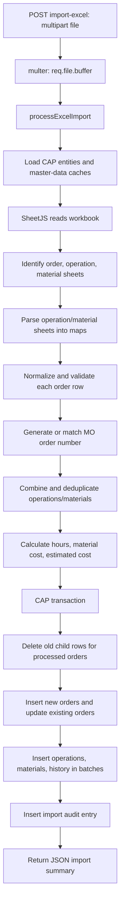

# Excel Import Service

Tài liệu này mô tả toàn bộ chức năng trong [srv/excel-import-service.js](srv/excel-import-service.js), module xử lý import maintenance order từ Excel vào CAP database.

## Điểm vào module

```js
const { processExcelImport } = require("./srv/excel-import-service");

const result = await processExcelImport(fileBuffer, currentUser, {
  onProgress: ({ percent, message }) => {
    // Optional progress callback
  },
});
```

`processExcelImport` nhận `Buffer` hoặc `Readable stream`. API HTTP hiện gọi hàm này từ `POST /api/maintenance/import-excel` trong [server.js](server.js).

## Các function

| Function                                               | Public                           | Mục đích                                                                                                                                                                                                |
| ------------------------------------------------------ | -------------------------------- | ------------------------------------------------------------------------------------------------------------------------------------------------------------------------------------------------------- |
| `parseAndValidateDate(rawDate, locale)`                | Yes                              | Xác thực và chuẩn hóa ngày về `YYYY-MM-DD`. Kiểm tra tính hợp lệ trên lịch, số serial Excel, định dạng DD/MM/YYYY. Trả về `{ valid: true, dateStr }` hoặc `{ valid: false, error }`. |
| `normalizeMaintenanceType(raw)`                        | Yes                              | Quy đổi text type về `PREVENTIVE`, `CORRECTIVE`, hoặc `EMERGENCY`. Nhận cả từ khóa tiếng Anh và tiếng Việt như `PHÒNG`, `SỬA CHỮA`, `KHẨN`. Mặc định là `PREVENTIVE`.                                   |
| `normalizePriority(raw)`                               | Yes                              | Quy đổi priority và UI state tương ứng. Trả `{ priority, priorityState }`, ví dụ `CRITICAL`/`Error`, `HIGH`/`Error`, `MEDIUM`/`Warning`, `LOW`/`Success`.                                               |
| `normalizeRowKeys(object)`                             | No                               | Đổi tên cột Excel thành lower-case, bỏ whitespace, `_`, `-`, `#`, `.`, `(`, `)`, `/`. Nhờ đó các cách đặt header khác nhau vẫn được đọc được.                                                           |
| `getRowField(normalizedRow, keys, defaultValue)`       | No                               | Lấy giá trị không rỗng đầu tiên trong danh sách tên cột tương đương; nếu không có thì dùng default.                                                                                                     |
| `batchInsert(entity, entries, batchSize)`              | No                               | Insert theo chunk song song qua `Promise.all`, mặc định `500` record/lần, tránh vượt giới hạn parameter của HANA/SQLite.                                                                                  |
| `processExcelImport(fileSource, currentUser, options)` | Yes                              | Luồng import chính: đọc workbook, validate/chuẩn hóa, upsert order, thay thế operations/materials và tạo audit/history.                                                                                 |
| `notifyProgress(percent, message)`                     | Local trong `processExcelImport` | Gọi `options.onProgress` nếu được truyền vào. Lỗi callback chỉ log warning, không làm fail import.                                                                                                      |
| `findEntity(name)`                                     | Local trong `processExcelImport` | Lấy CDS entity trong namespace `sap.cap.maintenance`; fallback sang tên đầy đủ nếu runtime chưa resolve entity object.                                                                                  |

Module export các helper chính và `processExcelImport`:

```js
module.exports = {
  processExcelImport,
  generateErrorWorkbookBuffer,
  parseAndValidateDate,
  normalizeMaintenanceType,
  normalizePriority,
};
```

## Cấu trúc Excel được hỗ trợ

Workbook phải có ít nhất một sheet order. Service tìm sheet theo tên, không phân biệt upper/lower-case, whitespace, `_` hay `-`:

| Vai trò    | Sheet name được nhận diện                 | Fallback                                   |
| ---------- | ----------------------------------------- | ------------------------------------------ |
| Orders     | `MaintenanceOrders`                       | Sheet đầu tiên                             |
| Operations | `Operations` hoặc `MaintenanceOperations` | Không có thì dùng inline/default operation |
| Materials  | `Materials` hoặc `OrderMaterials`         | Không có thì dùng inline/no material       |

Các header orders được nhận qua alias. Ví dụ `Order`, `OrderNo`, `Order ID`; `Equipment`, `EquipmentNo`; `ScheduledFrom`, `StartDate`; `ScheduledTo`, `EndDate`; `Operations`; `Materials`.

Operations và materials ở sheet phụ có thể được ghép theo `order_no` hoặc theo `equipment`. Operations inline nhận format như `10:Inspect:2;20:Replace:4`; materials inline nhận format như `MAT-001:2;MAT-002:1`.

## Flow xử lý



## Chi tiết `processExcelImport`

### 1. Chuẩn bị và cache master data

Service kết nối `cds.connect.to("db")`, sau đó query song song:

- `Equipments`
- `Plants`
- `MaintenanceTypes`
- `Priorities`
- `Planners`
- `WorkCenters`
- `MaterialCatalog`
- `MaintenanceOrders`

Dữ liệu này được đưa vào `Set`/`Map` để validate nhanh. Nó cũng tính `maxOrderSeq` từ các order `MO-<number>` đã có để phát sinh order number mới liên tiếp.

### 2. Đọc và parse workbook

SheetJS (`xlsx`) đọc toàn bộ workbook từ buffer. Service fail ngay nếu workbook không có sheet hoặc sheet order không có row.

Operations và materials từ sheet phụ được gom vào `Map` theo order/equipment. Material dùng `MaterialCatalog` để lấy description, unit và unit price; nếu không tồn tại, default price là `25.0`.

### 3. Xử lý từng order

Với mỗi row không rỗng, service:

1. Chuẩn hóa equipment, plant, planner, maintenance type, priority, scheduled dates.
2. Giữ lại order hiện hữu nếu input có `MO-...` tồn tại trong DB; ngược lại phát sinh `MO-<nextOrderNum>`.
3. Nếu order number lặp trong chính file, phát sinh order number mới để tránh đụng key.
4. Parse operations/materials inline, rồi kết hợp với dữ liệu sheet phụ.
5. Deduplicate operations theo `(order_no, no)`; trùng operation number sẽ được resequence theo bước `10`.
6. Deduplicate materials theo `(order_no, material)` và cộng quantity/value khi trùng.
7. Nếu không có operation, tạo default operation `10 - Standard Maintenance & Inspection`.
8. Tính `planned_hours`, material cost và `estimated_cost = material cost + planned hours * 50`.

Order mới được đưa vào `ordersToInsert`; order đã có được đưa vào `ordersToUpdate`. Service cũng chuẩn bị arrays cho operations, materials và history.

## Ghi database

Toàn bộ phần ghi order/operation/material/history nằm trong một `cds.tx`, nên lỗi trong transaction sẽ rollback phần ghi đó.

| Thứ tự | Thao tác                                                                                                    |
| ------ | ----------------------------------------------------------------------------------------------------------- |
| 1      | Xóa `MaintenanceOperations` và `OrderMaterials` cũ của mọi order được xử lý, theo chunk `200` order number. |
| 2      | Insert orders mới vào `MaintenanceOrders`, batch `500`.                                                     |
| 3      | Update field của orders hiện hữu trong `MaintenanceOrders`.                                                 |
| 4      | Dedupe thêm một lần trước khi insert operations, sau đó batch insert `MaintenanceOperations` theo `500`.    |
| 5      | Dedupe/merge thêm một lần trước khi insert materials, sau đó batch insert `OrderMaterials` theo `500`.      |
| 6      | Batch insert `OrderHistory` theo `500`. History chỉ được tạo khi tổng số order import không vượt `5000`.    |
| 7      | Sau transaction, insert một record tổng kết vào `AuditHistory` nếu có ít nhất một order được import.        |

## Progress callback

`options.onProgress` được gọi ở các mốc:

| Progress | Nội dung                                     |
| -------- | -------------------------------------------- |
| 5        | Loading master data cache                    |
| 15       | Reading Excel workbook                       |
| 20-65    | Validating order rows, cập nhật mỗi 100 rows |
| 70       | Saving orders                                |
| 85       | Saving operations and materials              |
| 95       | Recording audit history                      |
| 100      | Completed processing rows                    |

Hiện REST endpoint gọi `processExcelImport` nhưng chưa truyền `onProgress` ra client. Vì vậy đây mới là hook nội bộ, chưa phải progress UI realtime.

## Response thành công

```json
{
  "success": true,
  "totalRows": 50000,
  "importedCount": 50000,
  "createdCount": 50000,
  "updatedCount": 0,
  "operationsCount": 50000,
  "materialsCount": 0,
  "failedCount": 0,
  "durationMs": 0,
  "durationSec": "0.00s",
  "warnings": [],
  "errors": []
}
```

`errors` và `warnings` được trả về để UI hiển thị summary. Ở implementation hiện tại, row validation chủ yếu áp dụng fallback/default value; `failedCount` được trả cố định là `0`.

## Giới hạn hiện tại

- API hiện là synchronous: HTTP response chỉ được trả sau khi parse và ghi database hoàn tất.
- Express dùng `multer.memoryStorage()`: file Excel được giữ toàn bộ trong RAM.
- `onProgress` chưa được expose qua polling, Server-Sent Events hoặc WebSocket.
- Với upload/import lớn, proxy/frontend timeout có thể xảy ra trước khi service trả response. Cần import job bất đồng bộ có `jobId` nếu muốn xử lý ổn định cho file lớn.
